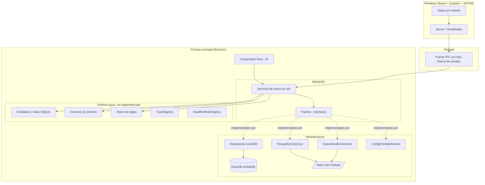
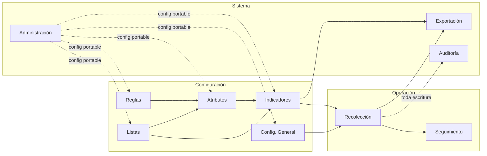
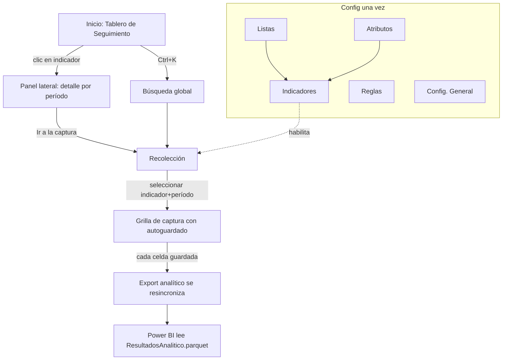

# Arquitectura de la Solución

## 1. Visión general

KPITracker es una aplicación de escritorio offline-first que se comporta como un pequeño sistema de gestión de datos institucionales. Sus principios rectores:

1. **La configuración nunca depende del código**: indicadores, atributos, listas, reglas, desagregaciones y periodicidades se administran desde la propia aplicación.
2. **Extensión sin modificación (OCP)**: tipos de dato, reglas de fecha límite, operadores del motor de reglas y métodos de cálculo de metas viven en *registros extensibles*; agregar uno nuevo no toca el núcleo.
3. **Separación estricta de capas**: interfaz, lógica de negocio y persistencia no se conocen entre sí más que por interfaces.

## 2. Pila tecnológica y justificación

| Decisión | Alternativas evaluadas | Justificación |
|---|---|---|
| **Electron 33** | .NET/WPF, .NET/Avalonia, Tauri | Multiplataforma; Node.js en el proceso principal permite usar DuckDB nativo sin instalación; madurez del ecosistema para UI de alta productividad; pruebas E2E automatizables con Playwright. |
| **React 18 + TypeScript estricto** | Vue, Svelte | Tipado de punta a punta (dominio ⇄ IPC ⇄ vista); ecosistema de componentes; `noUncheckedIndexedAccess` y `strict` eliminan clases enteras de errores. |
| **Zustand (MVVM)** | Redux, MobX | Stores = ViewModels sin boilerplate. Las vistas son funciones puras del estado del ViewModel. |
| **DuckDB embebido** (`@duckdb/node-api`) | SQLite, LiteDB, archivos JSON | Motor columnar OLAP embebido (cero instalación) con lectura/escritura Parquet nativa, joins, agregaciones y particionamiento Hive; ideal para la capa analítica. |
| **Apache Parquet** | CSV, JSON, SQLite | Formato columnar estándar, consumible directamente por Power BI/pandas/Spark; compresión eficiente; tipado. |
| **Zod** | io-ts, ajv | Validación de la configuración portable JSON versionada y de los contratos IPC. |
| **Vitest + Playwright** | Jest + Spectron | Vitest comparte la config de Vite; Playwright automatiza la app Electron real (pruebas de aceptación). |
| **DI manual (composition root)** | InversifyJS, tsyringe | Cablear ~15 dependencias no justifica un contenedor; la composición explícita es trazable, tipada y testeable. |

## 3. Capas (Clean Architecture)

Reglas de dependencia (verificadas por ESLint `no-restricted-imports` en `src/domain`):

- **domain** no importa nada de otras capas ni librerías de UI/IO.
- **application** solo importa domain (usa puertos, no implementaciones).
- **infrastructure** implementa los puertos; es la única capa que toca DuckDB y el sistema de archivos.
- **renderer** solo conoce el contrato IPC (`src/shared/ipc.ts`), jamás la persistencia.

## 4. Diagrama de módulos funcionales

Agregar un módulo nuevo = añadir una entrada al registro `MODULOS` del shell (`src/renderer/src/App.tsx`), sus canales IPC al contrato y sus casos de uso; ningún módulo existente se modifica.

## 5. Flujo de navegación

## 6. Flujo de una escritura (autoguardado)

1. La vista confirma una celda → ViewModel (`useRecoleccion.guardarCelda`).
2. IPC `recoleccion:guardarCelda` → manejador en el composition root.
3. `ServicioRecoleccion` parsea/valida con el `TypeRegistry`, hace *upsert* por clave natural en el repositorio.
4. El repositorio marca la partición del año como sucia; `ParquetSyncService` la materializa con debounce.
5. Se registra auditoría (valor anterior → nuevo) y se solicita la regeneración del export analítico (debounce).
6. La respuesta actualiza el ViewModel: la celda muestra el estado *guardada*.

No existe botón Guardar en la captura; ante un cierre de la aplicación, `before-quit` fuerza el volcado de todo lo pendiente a Parquet.
