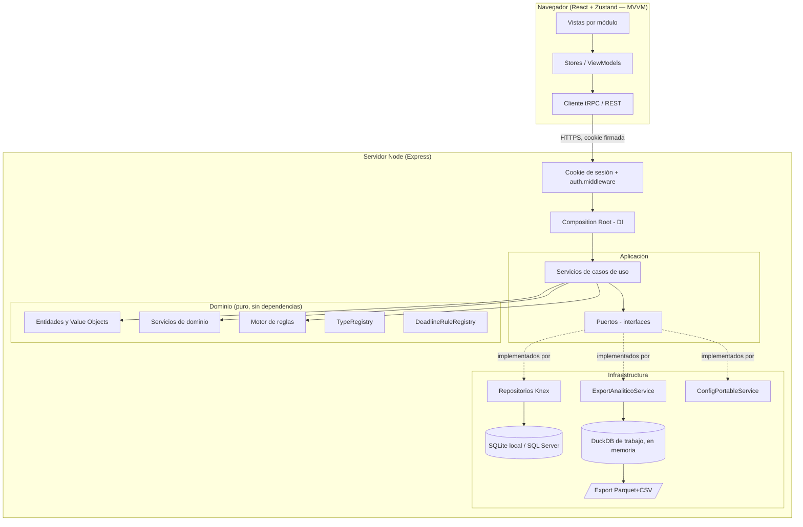
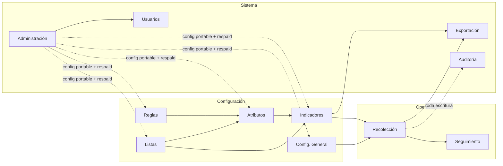
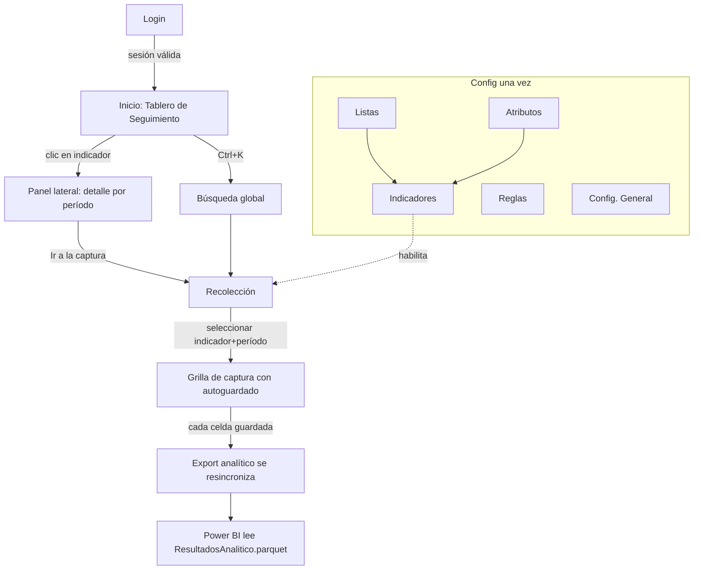

# Arquitectura de la Solución

## 1. Visión general

KPITracker es una aplicación **web multi-usuario** que se comporta como un pequeño sistema de gestión de datos institucionales. Nació como una aplicación de escritorio offline-first (Electron + DuckDB embebido) y fue migrada a un servidor Node/Express con persistencia relacional (Knex) y autenticación real, conservando intacto el dominio y la lógica de aplicación — solo cambiaron el transporte, la persistencia y quién puede usarla al mismo tiempo. Sus principios rectores:

1. **La configuración nunca depende del código**: indicadores, atributos, listas, reglas, desagregaciones y periodicidades se administran desde la propia aplicación.
2. **Extensión sin modificación (OCP)**: tipos de dato, reglas de fecha límite, operadores del motor de reglas y métodos de cálculo de metas viven en *registros extensibles*; agregar uno nuevo no toca el núcleo.
3. **Separación estricta de capas**: interfaz, lógica de negocio y persistencia no se conocen entre sí más que por interfaces.

## 2. Pila tecnológica y justificación

| Decisión | Alternativas evaluadas | Justificación |
|---|---|---|
| **Express + tRPC** | REST a mano, GraphQL, Electron IPC (arquitectura original) | Los ~90 procedimientos de la API son efectivamente un mapa RPC tipado de punta a punta (servidor ⇄ cliente) sin generar esquemas ni documentación aparte; unas pocas rutas REST planas cubren archivos (multipart/streaming), que no encajan bien en tRPC. |
| **React 18 + TypeScript estricto** | Vue, Svelte | Tipado de punta a punta (dominio ⇄ tRPC ⇄ vista); ecosistema de componentes; `noUncheckedIndexedAccess` y `strict` eliminan clases enteras de errores. |
| **Zustand (MVVM)** | Redux, MobX | Stores = ViewModels sin boilerplate. Las vistas son funciones puras del estado del ViewModel. |
| **Knex sobre `better-sqlite3` (local) / `mssql` (producción)** | Un único motor fijo, ORM completo (Prisma/TypeORM) | Mismo query builder y mismo motor de migraciones sobre dos dialectos: SQLite sin instalación para desarrollo/pruebas, SQL Server real en producción apuntando `DB_CLIENT=mssql` a un servidor vacío — `knex migrate:latest` crea el esquema completo ahí sin paso manual de DBA. |
| **Cookies de sesión firmadas** (`cookie-parser` + `bcryptjs`) | JWT autocontenido | Una sesión real en base de datos es trivialmente revocable (logout, logout forzado) sin el problema de invalidación de JWT; es el punto de enganche donde conectar Azure AD más adelante sin tocar el resto (`IAuthProvider`, ver `docs/07-plan-pruebas.md` y el código de `src/infrastructure/auth/`). |
| **DuckDB embebido** (`@duckdb/node-api`), acotado a la exportación analítica | SQLite, LiteDB, archivos JSON | Ya no es el almacén OLTP de la aplicación (eso es Knex) — se conserva exclusivamente como motor de escritura Parquet/CSV: una instancia de trabajo en memoria, de vida corta, que recibe las filas ya persistidas y produce la capa analítica para Power BI (ver `src/infrastructure/export/`). |
| **Apache Parquet** | CSV, JSON, SQLite | Formato columnar estándar, consumible directamente por Power BI/pandas/Spark; compresión eficiente; tipado. |
| **Zod** | io-ts, ajv | Validación de la configuración portable JSON versionada y de los contratos de entrada de la API. |
| **Vitest + Playwright** | Jest + Spectron | Vitest comparte la config de Vite; Playwright automatiza un Chromium real contra el servidor Express + la SPA servida estáticamente (pruebas de aceptación) — cada spec levanta su propia instancia aislada, igual que antes hacía con el proceso Electron. |
| **DI manual (composition root)** | InversifyJS, tsyringe | Cablear las dependencias de infraestructura no justifica un contenedor; la composición explícita (`src/infrastructure/bootstrap.ts`) es trazable, tipada y testeable. |

## 3. Capas (Clean Architecture)

Reglas de dependencia (verificadas por ESLint `no-restricted-imports` en `src/domain`):

- **domain** no importa nada de otras capas ni librerías de UI/IO.
- **application** solo importa domain (usa puertos, no implementaciones).
- **infrastructure** implementa los puertos; es la única capa que toca Knex, DuckDB y el sistema de archivos.
- **renderer** solo conoce el cliente tRPC/REST (`src/renderer/src/trpc.ts`, `rest.ts`) y el contrato de tipos compartido (`src/shared/ipc.ts`), jamás la persistencia.

## 4. Diagrama de módulos funcionales

Agregar un módulo nuevo = añadir una entrada al registro `MODULOS` del shell (`src/renderer/src/App.tsx`, con su ruta en `react-router-dom`), sus procedimientos tRPC (o rutas REST, si maneja archivos) y sus casos de uso; ningún módulo existente se modifica.

## 5. Flujo de navegación

Toda ruta salvo `/login` está protegida por un guard de sesión (`RequireAuth`, en el renderer) que redirige a `/login` si no hay usuario autenticado, y por `protectedProcedure`/`adminProcedure` del lado del servidor (la barrera real — el guard del cliente es solo UX).

## 6. Flujo de una escritura (autoguardado)

1. La vista confirma una celda → ViewModel (`useRecoleccion.guardarCelda`).
2. Mutación tRPC `recoleccion.guardarCelda` (cookie de sesión incluida) → resolver en el servidor, que valida la sesión y delega en el composition root.
3. `ServicioRecoleccion` parsea/valida con el `TypeRegistry`, hace *upsert* por clave natural directamente contra la base relacional (Knex — SQLite local o SQL Server), dentro de una transacción.
4. Se registra auditoría (valor anterior → nuevo, con el usuario de la sesión) y se solicita la regeneración de la exportación analítica (debounce).
5. La respuesta actualiza el ViewModel: la celda muestra el estado *guardada*.

No existe botón Guardar en la captura: cada celda se persiste de inmediato y de forma síncrona en la base relacional (sin una materialización aparte que pueda quedar pendiente). Lo único diferido es la exportación analítica (Parquet/CSV para Power BI) — si el servidor se detiene antes de que venza el debounce, en el peor caso esa regeneración queda un poco atrasada respecto a los datos ya guardados, nunca al revés.
