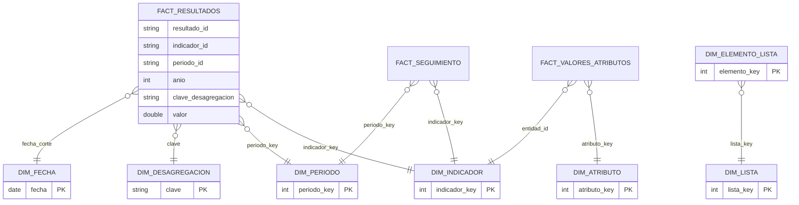
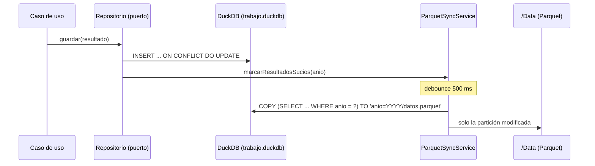

# Modelo de Datos

Aunque el almacenamiento físico es Parquet, el diseño lógico sigue principios relacionales y de modelado dimensional: claves surrogadas, integridad referencial lógica (validada en la capa de aplicación), tablas de hechos y dimensiones.

## 1. Modelo Entidad–Relación (configuración y operación)

```mermaid
erDiagram
    LISTA ||--o{ ELEMENTO_LISTA : contiene
    ELEMENTO_LISTA |o--o{ ELEMENTO_LISTA : "padre (jerarquía)"
    LISTA ||--o{ INDICADOR_DESAGREGACION : "usada como desagregación"
    INDICADOR ||--o{ INDICADOR_DESAGREGACION : declara
    INDICADOR ||--o{ META : tiene
    INDICADOR ||--o{ LEVANTAMIENTO : "estado por período"
    INDICADOR ||--o{ RESULTADO : registra
    LEVANTAMIENTO ||--o{ RESULTADO : "fecha de corte compartida"
    ATRIBUTO ||--o{ VALOR_ATRIBUTO : "valores EAV"
    INDICADOR ||--o{ VALOR_ATRIBUTO : "atributos dinámicos"
    ATRIBUTO }o--o| LISTA : "tipo SelectionList"
    REGLA_NEGOCIO }o--o| ATRIBUTO : "atributo objetivo"

    INDICADOR {
        string id PK
        string nombre
        string definicion
        string periodicidad
        double linea_base
        double meta_global
        json desagregaciones "ids de listas"
        string estado
        string responsable "preparado, sin flujo"
        string categoria "preparado, sin flujo"
    }
    ATRIBUTO {
        string id PK
        string entidad
        string nombre
        string grupo
        int orden
        bool visible
        bool editable
        bool obligatorio
        string tipo_dato
        json validaciones
        json condicion_visibilidad "AST del motor de reglas"
        json condicion_obligatorio
    }
    LISTA {
        string id PK
        string nombre
        string estado
        int version
        bool jerarquica
    }
    ELEMENTO_LISTA {
        string id PK
        string lista_id FK
        string codigo
        string descripcion
        int orden
        string padre_codigo "opcional"
        bool activo
    }
    META {
        string id PK
        string indicador_id FK
        string clave_desagregacion "GENERAL o lista=codigo|..."
        double valor
        string periodicidad_medicion
        string metodo_calculo "Promedio/Sumatoria/UltimoValor/..."
        int anio_vigencia
    }
    RESULTADO {
        string id PK
        string indicador_id FK
        string periodo_id "2025-Trimestral-01"
        int anio "clave de partición"
        string clave_desagregacion
        double valor
    }
    LEVANTAMIENTO {
        string id PK
        string indicador_id FK
        string periodo_id
        date fecha_corte "única por período"
        json desagregaciones_excluidas "exclusión temporal"
    }
    VALOR_ATRIBUTO {
        string atributo_id PK_FK
        string entidad_tipo PK
        string entidad_id PK
        string valor_texto
        double valor_numero
        string valor_fecha
        bool valor_booleano
    }
    REGLA_NEGOCIO {
        string id PK
        string tipo "Visibilidad/Obligatoriedad/ValidacionCruzada"
        json condicion "AST"
        string mensaje_error
    }
```

Claves de diseño:

- **Atributos dinámicos (EAV tipado)**: los metadatos viven en `ATRIBUTO`; los valores en `VALOR_ATRIBUTO` con una columna física por familia de tipo (`texto`, `numero`, `fecha`, `booleano`). El `TypeRegistry` del dominio decide en qué columna persiste cada tipo.
- **Clave de desagregación canónica**: la combinación se serializa como `listaId=codigo|listaId=codigo` ordenada por `listaId`; la fila del total usa el literal `GENERAL`. Esto la hace estable, comparable y apta como clave técnica.
- **Fecha de corte**: vive en `LEVANTAMIENTO` (una por indicador+período) y es compartida por todas las desagregaciones del período, como exige la especificación.
- **Exclusión temporal**: `LEVANTAMIENTO.desagregaciones_excluidas` afecta solo a ese período; la configuración del indicador nunca se modifica.

## 2. Modelo dimensional (Star Schema)



- **Grano de `FactResultados`**: indicador × período × combinación de desagregación (incluida la fila `GENERAL`).
- **`DimPeriodo`** se genera para todas las periodicidades desde el año inicial (id estable `AAAA-Periodicidad-NN`).
- **`DimFecha`** es un calendario continuo (día, mes, trimestre, día de semana ISO, año-mes) generado con `generate_series` de DuckDB.
- Las claves surrogadas (`*_key`) se asignan al materializar las dimensiones; los hechos conservan además las claves naturales para trazabilidad.

## 3. Data Lake local (organización física)

```
/Data
  /Config                        ← estado de configuración (una tabla = un Parquet)
    Indicadores.parquet
    Atributos.parquet
    Reglas.parquet
    Listas.parquet
    ElementosLista.parquet
    Metas.parquet
  /Dimensions                    ← regeneradas en cada exportación
    DimIndicador.parquet  DimPeriodo.parquet  DimFecha.parquet
    DimDesagregacion.parquet  DimLista.parquet  DimElementoLista.parquet  DimAtributo.parquet
  /Facts
    FactResultados/anio=2024/datos.parquet    ← particionado Hive por año
    FactResultados/anio=2025/datos.parquet
    FactSeguimiento.parquet                   ← levantamientos (fecha de corte, exclusiones)
    FactValoresAtributos.parquet
  /Logs
    Auditoria.parquet
  /Export
    ResultadosAnalitico.parquet  (+ .csv opcional)
  Configuracion.json             ← parámetros globales (legible y editable)
  trabajo.duckdb                 ← almacén de trabajo (detalle interno)
```

## 4. Capa de persistencia con DuckDB embebido



Decisiones:

- **DuckDB es un detalle interno**: solo `src/infrastructure` lo importa; el usuario nunca interactúa con él. Reemplazar el motor = reimplementar los puertos.
- **Almacén de trabajo + Parquet canónico**: las escrituras van a una base DuckDB local (transaccional, rápida y segura ante cortes); un sincronizador materializa a Parquet con debounce. Esto da autoguardado instantáneo **sin reescrituras completas**: solo se vuelca la tabla modificada, y en `FactResultados` únicamente la partición (año) afectada.
- **Recuperación**: si `trabajo.duckdb` no existe pero hay Parquet (p. ej. reinstalación conservando `/Data`), las tablas se restauran automáticamente desde Parquet al arrancar (`restaurarDesdeParquetSiVacio`). Parquet es el formato persistente canónico.
- **Concurrencia**: una única conexión de escritura con cola de operaciones serializada (`Db.encolar`) y transacciones para operaciones multi-tabla.
- Al cerrar la aplicación, `before-quit` fuerza `sincronizar()` para que nada quede solo en el almacén de trabajo.
