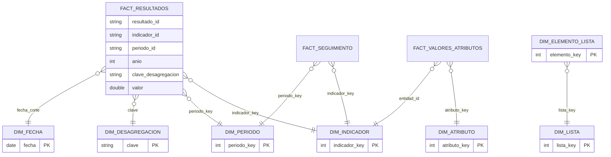
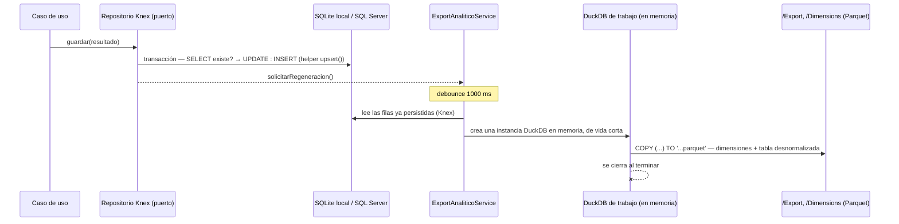

# Modelo de Datos

El almacenamiento operativo (OLTP) es una base relacional real vía Knex — SQLite local (`better-sqlite3`) para desarrollo/pruebas, SQL Server en producción — así que el diseño lógico que sigue ya es directamente el esquema físico: mismas 18+ tablas, mismos tipos portables (`VARCHAR`/`DOUBLE`/`INTEGER`/`BOOLEAN`), sin traducción intermedia. Solo la capa analítica (exportación para Power BI, §3–§4) sigue usando Parquet, con claves surrogadas y modelado dimensional (star schema).

## 1. Modelo Entidad–Relación (configuración y operación)

```mermaid
erDiagram
    LISTA ||--o{ ELEMENTO_LISTA : contiene
    ELEMENTO_LISTA |o--o{ ELEMENTO_LISTA : "padre (jerarquía)"
    LISTA ||--o{ INDICADOR_DESAGREGACION : "usada como desagregación"
    INDICADOR ||--o{ INDICADOR_DESAGREGACION : declara
    INDICADOR ||--o{ META : tiene
    INDICADOR ||--o{ LEVANTAMIENTO : "estado por período"
    INDICADOR ||--o{ RESULTADO : registra
    LEVANTAMIENTO ||--o{ RESULTADO : "fecha de corte compartida"
    ATRIBUTO ||--o{ VALOR_ATRIBUTO : "valores EAV"
    INDICADOR ||--o{ VALOR_ATRIBUTO : "atributos dinámicos"
    ATRIBUTO }o--o| LISTA : "tipo SelectionList"
    REGLA_NEGOCIO }o--o| ATRIBUTO : "atributo objetivo"
    INDICADOR }o--o| DEFINICION_PERIODICIDAD : "si periodicidad = Personalizada"
    INDICADOR }o--o| RESPONSABLE : asignado
    INDICADOR }o--o| CATEGORIA : clasificado

    INDICADOR {
        string id PK
        string nombre
        string definicion
        string periodicidad
        string periodicidad_personalizada_id FK "si periodicidad = Personalizada"
        double linea_base
        double meta_global
        json desagregaciones "ids de listas"
        string estado
        string responsable FK "id de Responsable"
        string categoria FK "id de Categoria"
    }
    DEFINICION_PERIODICIDAD {
        string id PK
        string nombre
        json cortes "numero, etiqueta, mes_inicio, mes_fin — cubre ene-dic sin huecos ni solapes"
    }
    RESPONSABLE {
        string id PK
        string nombre
        string correo
        bool activo
    }
    CATEGORIA {
        string id PK
        string nombre
        string descripcion
        bool activo
    }
    ATRIBUTO {
        string id PK
        string entidad
        string nombre
        string grupo
        int orden
        bool visible
        bool editable
        bool obligatorio
        string tipo_dato
        json validaciones
        json condicion_visibilidad "AST del motor de reglas"
        json condicion_obligatorio
    }
    LISTA {
        string id PK
        string nombre
        string estado
        int version
        bool jerarquica
    }
    ELEMENTO_LISTA {
        string id PK
        string lista_id FK
        string codigo
        string descripcion
        int orden
        string padre_codigo "opcional"
        bool activo
    }
    META {
        string id PK
        string indicador_id FK
        string clave_desagregacion "GENERAL o lista=codigo|..."
        double valor
        string periodicidad_medicion
        string metodo_calculo "Promedio/Sumatoria/UltimoValor/..."
        int anio_vigencia
    }
    RESULTADO {
        string id PK
        string indicador_id FK
        string periodo_id "2025-Trimestral-01"
        int anio "clave de partición"
        string clave_desagregacion
        double valor
    }
    LEVANTAMIENTO {
        string id PK
        string indicador_id FK
        string periodo_id
        date fecha_corte "única por período"
        json desagregaciones_excluidas "exclusión temporal"
    }
    VALOR_ATRIBUTO {
        string atributo_id PK_FK
        string entidad_tipo PK
        string entidad_id PK
        string valor_texto
        double valor_numero
        string valor_fecha
        bool valor_booleano
    }
    REGLA_NEGOCIO {
        string id PK
        string entidad "Indicador | Recoleccion"
        string tipo "Visibilidad/Obligatoriedad/ValidacionCruzada"
        string atributo_objetivo_id FK "solo Visibilidad/Obligatoriedad sobre Indicador"
        json condicion "AST"
        string mensaje_error
    }
```

Claves de diseño:

- **Atributos dinámicos (EAV tipado)**: los metadatos viven en `ATRIBUTO`; los valores en `VALOR_ATRIBUTO` con una columna física por familia de tipo (`texto`, `numero`, `fecha`, `booleano`). El `TypeRegistry` del dominio decide en qué columna persiste cada tipo.
- **Clave de desagregación canónica**: la combinación se serializa como `listaId=codigo|listaId=codigo` ordenada por `listaId`; la fila del total usa el literal `GENERAL`. Esto la hace estable, comparable y apta como clave técnica.
- **Fecha de corte**: vive en `LEVANTAMIENTO` (una por indicador+período) y es compartida por todas las desagregaciones del período, como exige la especificación.
- **Exclusión temporal**: `LEVANTAMIENTO.desagregaciones_excluidas` afecta solo a ese período; la configuración del indicador nunca se modifica.

## 2. Modelo dimensional (Star Schema)



- **Grano de `FactResultados`**: indicador × período × combinación de desagregación (incluida la fila `GENERAL`).
- **`DimPeriodo`** se genera para todas las periodicidades estándar desde el año inicial (id estable `AAAA-Periodicidad-NN`), más los períodos de cada `DefinicionPeriodicidad` efectivamente usada por algún indicador (`AAAA-Personalizada-NN`). Nota: dos definiciones distintas podrían producir el mismo `periodo_id` si comparten año y número de corte; no genera ambigüedad en los hechos porque su grano incluye `indicador_id` (ver roadmap para una futura desambiguación si se requiriera una `DimPeriodo` libre de colisiones).
- **`DimFecha`** es un calendario continuo (día, mes, trimestre, día de semana ISO, año-mes), cálculo puro sin dependencia de datos persistidos, generado con `generate_series` de DuckDB (la única pieza de este módulo que sigue siendo SQL de DuckDB tal cual, ver §4).
- Las claves surrogadas (`*_key`) se asignan al materializar las dimensiones; los hechos conservan además las claves naturales para trazabilidad.

## 3. Organización física en disco

La configuración e indicadores (todo lo modelado en §1) vive en la base relacional (Knex), no en archivos — un `SELECT` normal, no un directorio. Lo único que sigue viviendo como archivos en `KPITRACKER_DATA_DIR` es lo que genuinamente no es una fila de una tabla operativa:

```
/Data (KPITRACKER_DATA_DIR)
  /Dimensions                    ← regeneradas en cada exportación analítica
    DimIndicador.parquet  DimPeriodo.parquet  DimFecha.parquet
    DimDesagregacion.parquet  DimLista.parquet  DimElementoLista.parquet  DimAtributo.parquet
  /Export
    ResultadosAnalitico.parquet  (+ .csv opcional)   ← conectar Power BI aquí
  /Adjuntos
    <archivos subidos como evidencia de resultados>
  kpitracker.sqlite               ← solo con DB_CLIENT=better-sqlite3 (local/pruebas); con mssql, este directorio no lo tiene
```

## 4. Capa de persistencia

Dos motores con roles completamente distintos y sin solaparse:



Decisiones:

- **Knex es el almacén OLTP real**: transaccional, con doble dialecto (`better-sqlite3` local, `mssql` producción) sobre el mismo esquema — `knex migrate:latest` lo crea desde cero en un servidor SQL Server vacío, sin paso manual de DBA. Ningún repositorio usa sintaxis específica de un dialecto: el *upsert* ("¿existe esta clave? actualízala; si no, créala", envuelto en una transacción) reemplaza el `INSERT OR REPLACE`/`ON CONFLICT` que antes era específico de DuckDB.
- **DuckDB ya no es el almacén de trabajo de la aplicación** — es un detalle interno acotado exclusivamente a `ExportAnaliticoService` (`src/infrastructure/export/`): una instancia en memoria, creada y destruida en cada regeneración, cuyo único rol es escribir Parquet/CSV a partir de filas que ya vinieron de Knex. Nunca guarda nada por su cuenta ni sobrevive entre regeneraciones.
- **Sin partición por año en disco**: al ya no reescribir Parquet por partición en cada autoguardado (eso era una optimización del viejo almacén de trabajo DuckDB), la tabla `ResultadosAnalitico` y las dimensiones se regeneran completas en cada ejecución — a la escala de un solo espacio de trabajo compartido esto es sub-segundo; si el volumen creciera mucho, regenerar solo particiones sucias queda como mejora incremental (ver `docs/08-roadmap.md`).
- **Concurrencia de escritura**: cada `upsert()` corre dentro de su propia transacción Knex; dos escrituras concurrentes a la misma celda son "última en comprometerse gana" (determinístico, sin UI de conflictos — ver `docs/07-plan-pruebas.md`).
- **Nada que recuperar al arrancar**: al no haber un almacén de trabajo separado del formato canónico, no existe un paso de "restaurar si está vacío" — los datos ya están en la base relacional, que es durable por sí misma.
