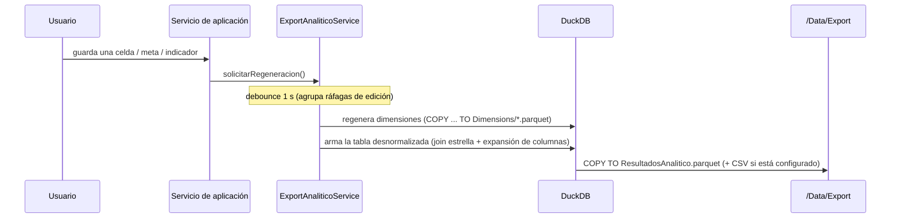

# Capa de Exportación Analítica (Power BI)

Además del modelo normalizado interno, la aplicación mantiene una **segunda capa completamente desnormalizada** orientada exclusivamente al consumo analítico (Power BI, Excel, pandas…). Ambas capas coexisten; la exportación nunca reemplaza al modelo normalizado.

## 1. La tabla `ResultadosAnalitico`

**Grano**: una fila = un resultado levantado (indicador × período × combinación de desagregación, incluida la fila General).

| Grupo | Columnas |
|---|---|
| Claves técnicas | `resultado_id`, `indicador_id`, `periodo_id` |
| Atributos del indicador | `indicador`, `definicion`, `periodicidad`, `estado`, `responsable`, `categoria`, `unidad_medida` |
| Tiempo | `anio`, `periodo` (etiqueta legible), `fecha_corte` |
| Desagregación | `es_general` (bool), `desagregacion` (clave canónica) y **una columna por lista de desagregación** con la descripción del elemento (`Sexo`, `Provincia`, …); las filas General llevan `Total` |
| Medidas | `valor`, `linea_base`, `meta` |
| Campos calculados | `variacion_linea_base` (= valor − línea base), `cumplimiento_meta_pct` (= valor/meta × 100) |
| Trazabilidad | `observacion`, `actualizado_en` |

Formatos: **Parquet siempre** (`/Data/Export/ResultadosAnalitico.parquet`); **CSV UTF-8 opcional**, activable en Configuración General.

Las columnas de desagregación se **expanden dinámicamente**: al agregar una desagregación a cualquier indicador, la próxima regeneración incluye la nueva columna. En Power BI no se requieren relaciones: la tabla se consume tal cual. Para modelos avanzados, las dimensiones del star schema (`/Data/Dimensions`) también están disponibles.

## 2. Estrategia de sincronización automática

- **Disparadores**: toda escritura que afecte la capa analítica (resultados, fecha de corte, metas, indicadores, valores de atributos, configuración) llama a `solicitarRegeneracion()`.
- **Debounce**: las ráfagas de captura (p. ej. pegar 50 celdas) producen una única regeneración ~1 s después de la última escritura, garantizando que el archivo plano esté siempre sincronizado sin costo por celda.
- **Serialización**: las regeneraciones se encadenan (nunca dos escrituras simultáneas del mismo archivo).
- Al cerrar la aplicación se fuerza el volcado pendiente, y el botón **Regenerar ahora** (módulo Exportación) permite forzarlo manualmente.

## 3. Rendimiento

- La construcción usa DuckDB (columnar, vectorizado); con volúmenes institucionales típicos (miles a cientos de miles de resultados) la regeneración es subsegundo a pocos segundos.
- Si el volumen creciera, el diseño admite regeneración incremental por partición (año/indicador) sin cambiar el contrato del archivo final — ver roadmap.
